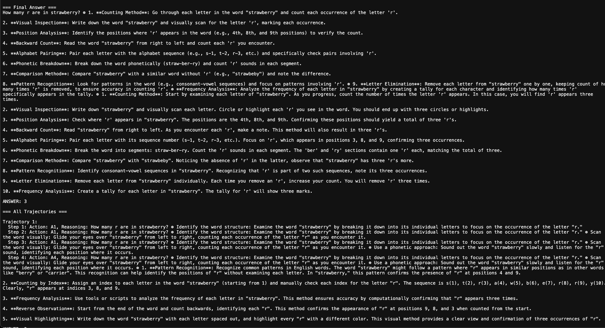

# Atlas Reasoning System (Toyberry)

## Overview



This project implements an  reasoning system based on the Atlas algorithm, an extension of Monte Carlo Tree Search (MCTS). The system uses large language models (LLMs) to generate and evaluate reasoning trajectories for complex problem-solving tasks. Mainly focus on getting the traces and trajectories of the reasoning process and to see how the system behaves. It can have varied applications 
- Undestanding the generation of thoughts
- Injection can help to break and can perform alignment esacpaces more realiably 
- Focused Synthetic data generation 
- More .. 

Check out the traces folder for the traces of the reasoning process. Its pretty interesting to see how the system behaves and how it emulate reasoning.
[Traces](traces/trace.txt) 


### Highlevel Data Flow 
1. User Input
   - Question to be answered
   - Provider choice (OpenAI or Azure)
   - Injected thoughts (as JSON)
   - Conditions (as JSON)
2. Initialization
   - Create LLM Interface (connects to OpenAI or Azure)
   - Set up Memory (stores information and past experiences)
   - Create Reward Function (evaluates actions)
   - Set up Discriminator (validates reasoning steps)
3. Memory Injection
   - Parse injected thoughts and conditions
   - Store them in the Memory component
4. Atlas Search Initialization
   - Create root node with the initial question
   - Set up search parameters (exploration weight, number of rollouts, etc.)
5. Atlas Search Process
   - For each rollout:
     a. Selection: Choose promising nodes to expand
     b. Expansion: Generate new reasoning steps using the LLM
     c. Simulation: Play out the reasoning to a conclusion
     d. Backpropagation: Update node statistics based on the outcome
6. Trajectory Collection
   - Gather all complete reasoning paths (trajectories) from the search tree
7. Trajectory Validation
   - Use the Discriminator to check each trajectory for consistency and validity
8. Best Trajectory Selection
   - Choose the best trajectory based on rewards and validation results
9. Confidence Calculation
   - Use the ConfidenceCalculator to assess the reliability of the answer
10. Result Compilation
    - Extract the final answer from the best trajectory
    - Prepare a summary of all trajectories and the confidence score
11. Output
    - Present the final answer, reasoning trajectories, and confidence score to the user

### Things where system topples 
- The Confidence Calculation  - Since we use a sentence transfomer for various metrics this can go awary.
- Tree growth and back porp - needs more thought here lot of room for optimization 
- Trajectory selection - This is Discriminator i.e a llm prompt if the llm is not strong this can topple the search to different directions.
- Actions and Reward Function - Adjust to domain and problem which step to improve, ideally these need to be populated by user question dynmaically will push the code once I clean up 
- Play with `generate_messages`  to improve for action responses this can help to improve 
- Beware of tokens - This is a token-monster eating away your tokens at large so be careful, play with roll_out param which can reduce the calls. 

### Key components:
- Atlas Search Algorithm
- Language Model Interface (using OpenAI's GPT-4)
- Memory Management
- Reward Function
- Discriminator for trajectory validation
- Visualization tools

## Installation

This project uses Poetry for dependency management.

1. Clone the repository:
   ```
   git clone https://github.com/ack-sec/toyberry.git
   cd atlas-reasoning-system
   ```

2. Install Poetry if you haven't already:
   ```
   curl -sSL https://install.python-poetry.org | python3 -
   ```

3. Install the project dependencies:
   ```
   poetry install
   ```

4. Create a `.env` file in the project root and add your LLM  keys, defaults to OpenAI's GPT-4. You can also add other keys for other LLMs.:
   ```
   OPENAI_API_KEY=your_api_key_here
   ANTHROPIC_API_KEY = "your_api_key_here"
   GROQ_API_KEY = "your_api_key_here"
   AZURE_ENDPOINT = "your_endpoint_here"
   AZURE_OPENAI_KEY = "your_key_here"
   AZURE_API_VERSION = "api_version_here"
   AZURE_MODEL_DEPLOYMENT = "model_deployment_here"
   AZURE_API_MODEL="api_model_here"
   ```
## Usage

To run the system, use the following command:
- Depending on the provider you want to use, you can specify the provider as `azure` or `openai` or `anthropic` or `groq` or `together` (default is OpenAI's GPT-4o)
- Not tested with other providers, but you can try with other providers as well.
- You can also inject thoughts and conditions to guide the reasoning process. This can be done by specifying the `injected_thoughts` and `conditions` parameters.

```
poetry run python  src/main.py --provider azure --injected_thoughts '{"spelling": "Consider the phonetic spelling of the word.", "general": "Think about any silent letters or letter combinations that might affect the count."}' --conditions '{"count": "Count each written occurrence of the letter.", "pronunciation": "Consider how the word is pronounced and if it affects the letter count."}' --question "How many r are in strawberry?"

```

The main script will:
1. Initialize all components (LLM interface, reward function, memory, etc.)
2. Set up the reasoning problem
3. Run the Atlas search algorithm
4. Display the best reasoning trajectory and confidence score
5. Generate a visualization of the Atlas search tree

You can modify the `main.py` file to change the reasoning problem, adjust parameters, or customize the output.

### UI 
- There is simple gradio script that can be used to interact with the system. You can run the script. I would recommend using the command line till this is fully tested. Main aim is to get the traces of the reasoning process and to see how the system behaves.
``` 
poetry run python src/app.py
```
- You can access the UI at `http://localhost:7860/` and interact with the system.
## System Components

### LLM Interface

The `LLMInterface` class handles communication with the language model (GPT-4). It provides methods for generating content, evaluating trajectories, and analyzing search results.

### Atlas Search

The Atlas search algorithm is implemented in the `ReasoningAtlasSearcher` and `ReasoningAtlasNode` classes. It explores the reasoning space by building a tree of possible trajectories.

### Memory

The `Memory` class manages the storage and retrieval of reasoning trajectories, allowing the system to learn from past experiences. This also helps to injecting knowledge domain guided knowledge, constraints and conditioning. This can be fun place to experiment with different ways to influence the reasoning process both for attack and defense and to see how the system behaves. 

### Reward Function

The `RewardFunction` class evaluates the quality of actions and states in the reasoning process, assigning rewards based on relevance, coherence, and other criteria. This is a key component of the system's performance. 

### Discriminator

The `Discriminator` class validates reasoning trajectories, ensuring consistency and quality in the generated solutions. This is good place to play with different ways to validate the reasoning process and to see how the system behaves. 

### Visualization

The `AtlasVisualizer` class generates graphical representations of the Atlas search tree, helping to understand the reasoning process.

## One layer deeper

The Atlas algorithm is based on the principles of Monte Carlo Tree Search (MCTS) but extends it for use in large state spaces, such as those encountered in reasoning tasks. Here are the key mathematical concepts:

1. **Tree Policy**: The algorithm uses the Upper Confidence Bound (UCB1) formula to balance exploration and exploitation:

   UCB1 = X̄_j + C * √(ln(n) / n_j)

   Where:
   - X̄_j is the average reward of node j
   - n is the number of times the parent node has been visited
   - n_j is the number of times child j has been visited
   - C is the exploration parameter (typically √2)

2. **Rollout Policy**: In the Atlas system, rollouts are performed using the language model to generate plausible continuations of the reasoning process.

3. **Backpropagation**: The rewards are propagated back up the tree, updating the Q-values (total reward) and visit counts (N) for each node:

   Q(s,a) = Q(s,a) + (reward - Q(s,a)) / N(s,a)

4. **Action Selection**: The best action is selected based on the highest Q-value among the children of the root node.

5. **Confidence Calculation**: The system calculates a confidence score based on the diversity and quality of the generated trajectories. This often involves semantic similarity measures and variance analysis.

The Atlas system extends these concepts by:
- Using a language model for node expansion and evaluation
- Incorporating a discriminator for trajectory validation
- Employing a  reward function that considers the quality and relevance of reasoning steps

By combining these mathematical principles with advanced language models, the Atlas-based reasoning system can effectively navigate complex problem spaces and generate high-quality solutions.

6. **TODO**:
- Dynamic Action Spaces: Unlike traditional MCTS, Atlas can be extended to dynamically generate and adjust  set of actions based on the analysis of the user question, allowing for more tailored and effective reasoning paths.

- Dynamic Reward Functions: Rewards in Atlas can be extended assigned contextually, considering the specific requirements and nuances of each question, which enhances the system's adaptability and performance.

- MultiAgent Atlas: Atlas can be extended to support multi-agent reasoning, where multiple agents collaborate to solve complex problems. This can be achieved by introducing communication and coordination mechanisms between agents.


## Contributing

Contributions to this project are welcome. Please fork the repository and submit a pull request with your changes.
This is not a full focus project of mine but will spend couple of hours every week, so expect delay in responses and fixes. 

## Copyright

This software is licensed under the Apache License, Version 2.0. See the LICENSE file for the full license text.

### Acknowledgments
There is a [awesome](https://github.com/hijkzzz/Awesome-LLM-Strawberry)  list  of papers and projects of strawberry like system, I extend full gratitude to the developers, authours and contributors of these projects for their invaluable contributions which helped me to understand the system better. 


